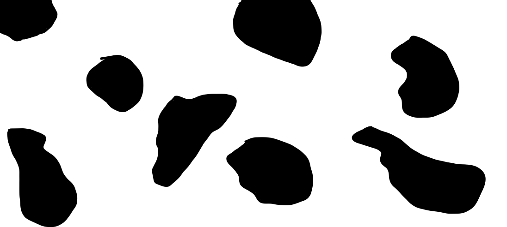
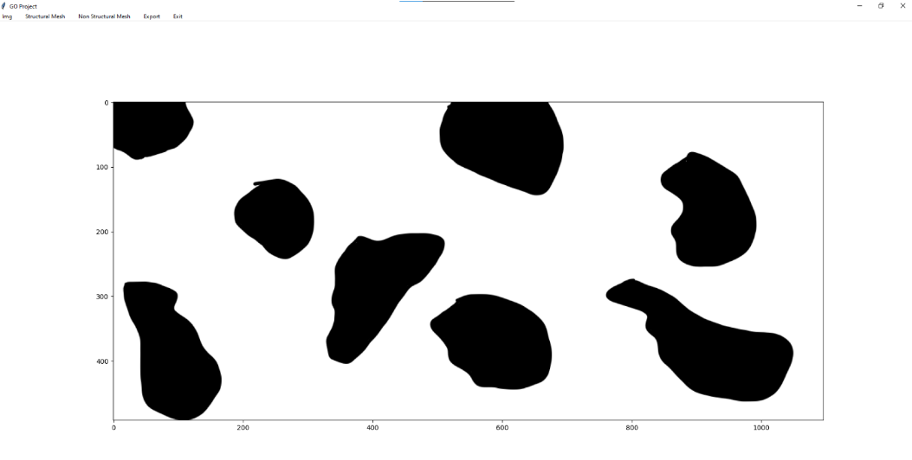
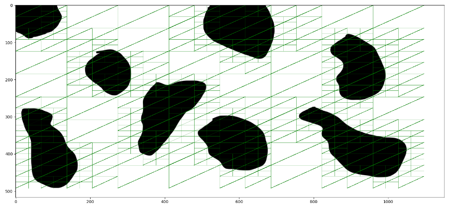
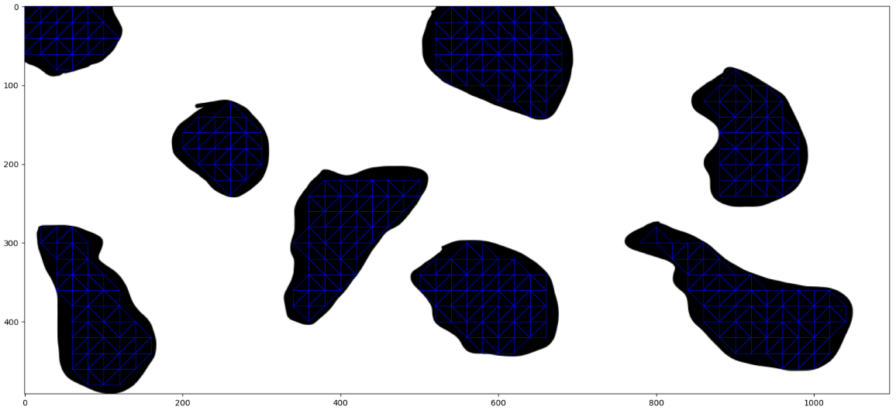
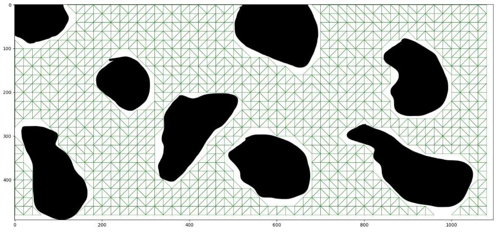

# Project Description: Structural and Non-Structural Mesh Generation

This project aims to generate both structural and non-structural meshes based on input images. It utilizes various computational geometry techniques, including Bowyer-Watson and Quadtree algorithms, implemented using Python with libraries such as Matplotlib and PIL (Python Imaging Library). The project provides a graphical user interface (GUI) using Tkinter for easy interaction and visualization.

## Key Components

1. **Structural Mesh Generation:**
    - Structural mesh generation involves dividing the image into triangular elements suitable for structural analysis.
    - The process begins by converting the input image into points, which represent vertices of triangles.
    - Quadtree algorithm is applied to recursively divide the image into smaller regions until specific conditions are met, ensuring the generation of appropriately sized triangles.
    - The generated mesh is visualized using Matplotlib.

2. **Non-Structural Mesh Generation:**
    - Non-structural mesh generation focuses on creating a mesh for various purposes like rendering or finite element analysis.
    - Bowyer-Watson algorithm is employed to triangulate the input points, ensuring the Delaunay property, which optimizes triangle shapes.
    - Different variations of Bowyer-Watson algorithm are applied based on the input image's characteristics, such as detailed or coarse mesh generation.
    - The resulting mesh is displayed using Matplotlib.

## User Interface

- The GUI provided by Tkinter offers a menu-based interface for easy navigation and execution of different mesh generation algorithms.
- Users can load images, select between structural and non-structural mesh generation, adjust parameters such as maximum space between points and splitting length, and export the generated mesh data.

## Future Enhancements

- Integration of additional mesh generation algorithms for further flexibility and optimization.
- Implementation of advanced visualization options to analyze and interact with generated meshes effectively.
- Performance optimization to handle larger input images and complex mesh generation tasks efficiently.
- Incorporation of error handling and validation mechanisms to improve user experience and robustness.

## Examples of using

- Input Image

    

- App GUI

    

- Structutal Basic Mesh (based od QuadTree Algorithm)

    

- Non-structutal Mesh - Black

    

- Non-structutal Mesh - white

    

## Conclusion

This project provides a comprehensive solution for generating both structural and non-structural meshes from input images. By leveraging computational geometry algorithms and a user-friendly interface, it offers flexibility and ease of use for various applications such as engineering simulations, computer graphics, and image processing.

## Author

This project was created by ([MaksKubiczek](https://github.com/MaksKubiczek)), ([Jakub Litewka](https://github.com/DarkRec)).