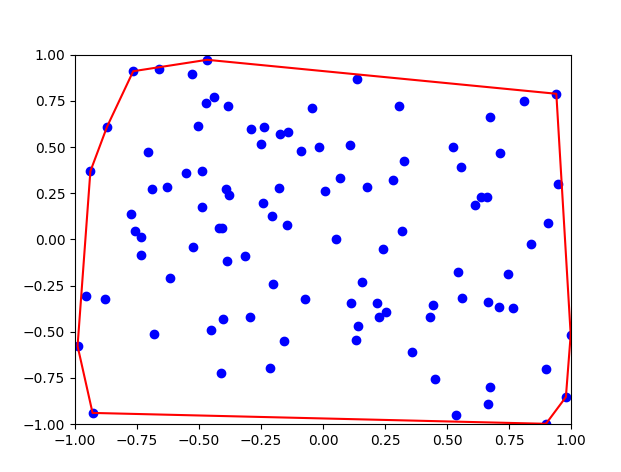

# Projekt Obliczania Otoki Wypukłej

## Przegląd

Ten projekt w języku Python ma na celu obliczenie otoki wypukłej zbioru losowo wygenerowanych punktów przy użyciu algorytmu Jarvisa. Otoka wypukła to najmniejszy wielokąt wypukły, który otacza wszystkie punkty w danym zbiorze. Algorytm Jarvisa, znany również jako algorytm opakowywania prezentu, to prosty i wydajny sposób na znalezienie otoki wypukłej skończonego zbioru punktów.

## Komponenty Projektu

### 1. Generowanie Losowych Punktów

- Generowane są losowe punkty w zakresie [-1, 1] dla obu współrzędnych x i y.

### 2. Implementacja Algorytmu Jarvisa

- **Funkcja Orientacji:** Określa orientację trzech punktów względem siebie.
- **Funkcja Algorytmu Jarvisa:** Oblicza otokę wypukłą wygenerowanych punktów przy użyciu algorytmu Jarvisa.

### 3. Tworzenie Wykresu

- Tworzony jest wykres za pomocą biblioteki Matplotlib w celu wizualizacji wygenerowanych punktów i ich otoki wypukłej.

## Jak to Działa

1. Generowane są losowe punkty w zakresie [-1, 1] dla obu współrzędnych x i y.
2. Zastosowany jest algorytm Jarvisa w celu obliczenia otoki wypukłej wygenerowanych punktów.
3. Wygenerowane punkty i ich otoka wypukła są przedstawiane na wykresie.

## Użycie

1. Uruchom skrypt w języku Python, aby wygenerować losowe punkty i obliczyć ich otokę wypukłą.
2. Wyświetl wygenerowany wykres, aby zwizualizować otokę wypukłą.

## Przykład

```python
# Kod w języku Python do generowania losowych punktów i obliczania otoki wypukłej
import random
import matplotlib.pyplot as plt

# funkcja do generowania losowych punktów
def generate_points(n):
    # kod do generowania losowych punktów

# funkcja pomocnicza do sprawdzania orientacji punktu względem prostej
def orientation(p, q, r):
    # kod funkcji orientacji

# funkcja implementująca algorytm Jarvisa
def jarvis(points):
    # kod algorytmu Jarvisa

# wygeneruj losowe punkty i oblicz otokę wypukłą
points = generate_points(100)
hull = jarvis(points)

# utwórz wykres i narysuj punkty oraz otokę wypukłą
fig, ax = plt.subplots()
ax.set_xlim([-1, 1])
ax.set_ylim([-1, 1])
ax.scatter([p[0] for p in points], [p[1] for p in points], color='blue')
ax.plot([p[0] for p in hull] + [hull[0][0]], [p[1] for p in hull] + [hull[0][1]], color='red')

plt.show()
```



## Autor

Ten projekt został stworzony przez [Maksymilian Kubiczek] ([@MaksKubiczek](https://github.com/MaksKubiczek)).

## Licencja

Ten projekt jest objęty licencją [MIT]. Więcej informacji znajduje się w pliku LICENSE.