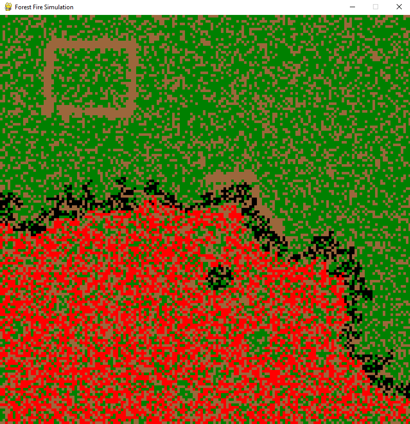

# Forest Fire Simulation Program Description

## Theoretical Introduction

Forest Fire Simulation is a simulation program written in Python using the Pygame library. The program's goal is to demonstrate the propagation of fire in a randomly generated forest. The simulation allows the user to interactively manipulate the forest terrain by igniting and extinguishing fires and removing trees.

The forest consists of randomly generated areas representing individual cells (rows and columns) with varying levels of humidity and tree presence. During the simulation, the user can ignite a fire in a random cell and observe how the fire spreads.

## Utilized Technologies

### Pygame

Pygame is a Python library dedicated to creating computer games. It provides a rich set of tools for handling graphics, sound, and user input. In the Forest Fire Simulation program, Pygame is used to create the graphical interface and handle events such as mouse clicks and key presses.

### NumPy

NumPy is a library for numerical computing in Python. It provides efficient data structures, matrix operations, and mathematical functions. In the Forest Fire Simulation program, NumPy is used to represent the forest terrain as a two-dimensional array and generate random values for terrain humidity.

## Functionality Description

The Forest Fire Simulation program allows the user to:

1. Generate a random forest terrain with varying humidity levels and tree presence.
2. Start a fire simulation by igniting a fire in a random cell.
3. Observe the propagation of fire in the forest terrain.
4. Extinguish fires by clicking on cells with fire.
5. Remove trees by right-clicking on cells with trees.

The user interface also includes a "Start Simulation" button, which initiates the simulation upon pressing the "1" key.

## File Contents

### main.py

The main program file containing the main program loop, event handling, Pygame window initialization, and game logic.

### terrain.py

A file containing functions related to generating forest terrain, such as generating random terrain, initiating fires, and propagating fire.

### cell.py

A module defining the Cell class, which represents a single cell in the forest terrain.

### actions.py

A file containing functions responsible for reacting to user actions, such as extinguishing fires and removing trees.

### utils.py

A module containing helper functions, such as drawing the "Start Simulation" button.

## Sample Graphics

Place for inserting sample graphics from program operation.

1. Initial Board:
   
   

2. Fire Spread
   
   

3. Extinguishing (Left Mouse Button)
   
   

4. Tree Removal (Right Mouse Button)
   
   

## Author

This project was created by [MaksKubiczek](https://github.com/MaksKubiczek).

## License

This project is licensed under the [MIT License]. For more information, see the LICENSE file.
