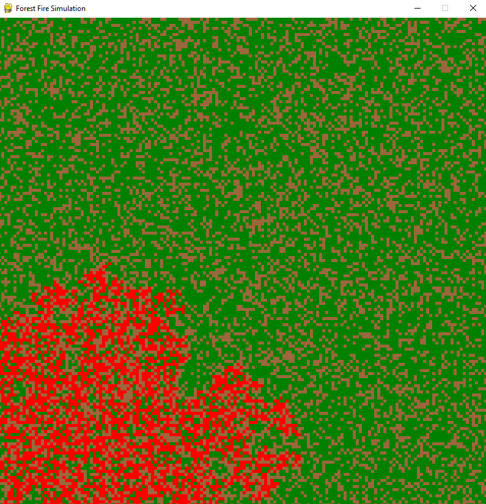

# Opis programu "Symulacja Pożaru Lasu"

## Wstęp Teoretyczny

Symulacja Pożaru Lasu to program symulacyjny napisany w języku Python przy użyciu biblioteki Pygame. Celem programu jest demonstracja propagacji pożaru w losowo wygenerowanym lesie. Symulacja pozwala użytkownikowi na interaktywne manipulowanie terenem lasu poprzez wywoływanie i gaszenie ognia oraz usuwanie drzew.

W lesie losowo generowane są obszary reprezentujące poszczególne komórki (rzędy i kolumny) o różnym stopniu wilgotności oraz obecności drzew. W trakcie symulacji użytkownik ma możliwość zapalania ognia na losowej komórce, a następnie obserwowania, jak ogień się rozprzestrzenia.

## Wykorzystane Technologie

### Pygame

Pygame to biblioteka w języku Python dedykowana do tworzenia gier komputerowych. Posiada bogaty zestaw narzędzi do obsługi grafiki, dźwięku i wejścia użytkownika. W programie "Symulacja Pożaru Lasu" Pygame zostało wykorzystane do stworzenia interfejsu graficznego oraz obsługi zdarzeń takich jak kliknięcia myszą czy wciskanie klawiszy.

### NumPy

NumPy to biblioteka do obliczeń numerycznych w języku Python. Zapewnia efektywne struktury danych, operacje na macierzach oraz funkcje matematyczne. W programie "Symulacja Pożaru Lasu" NumPy zostało użyte do reprezentacji terenu lasu w postaci dwuwymiarowej tablicy oraz do generowania losowych wartości dla wilgotności terenu.

## Opis Funkcjonalności

Program "Symulacja Pożaru Lasu" umożliwia użytkownikowi:

1. Generowanie losowego terenu lasu z różnymi stopniami wilgotności i obecnością drzew.
2. Rozpoczynanie symulacji pożaru poprzez wywołanie ognia na losowej komórce.
3. Obserwowanie propagacji pożaru na terenie lasu.
4. Gaszenie ognia poprzez kliknięcie na komórkę z ogniem.
5. Usuwanie drzew poprzez prawokliknięcie na komórkę z drzewem.

W interfejsie użytkownika znajduje się również przycisk "Start Simulation", który umożliwia rozpoczęcie symulacji po naciśnięciu klawisza "1".

## Zawartość Plików

### main.py

Główny plik programu, który zawiera główną pętlę programu, obsługę zdarzeń, inicjalizację okna Pygame oraz logikę gry.

### terrain.py

Plik zawierający funkcje związane z generowaniem terenu lasu, takie jak generowanie losowego terenu, rozpoczynanie pożaru oraz propagacja ognia.

### cell.py

Moduł definiujący klasę Cell, która reprezentuje pojedynczą komórkę na terenie lasu.

### actions.py

Plik zawierający funkcje odpowiedzialne za reakcje na akcje użytkownika, takie jak gaszenie ognia i usuwanie drzew.

### utils.py

Moduł zawierający funkcje pomocnicze, takie jak rysowanie przycisku "Start Simulation".

## Przykładowe Grafiki

Miejsce na wstawienie przykładowych grafik z działania programu.

1. Plansza wejściowa:
    
    

2. Rozprzestrzenianie się ognia
    
    

3. Gaszenie (Lewy przycisk myszy)
    
    

4. Wycinanie drzew (Prawy przycisk myszy)
    
    

## Autor

Ten projekt został stworzony przez ([MaksKubiczek](https://github.com/MaksKubiczek)).

## Licencja

Ten projekt jest objęty licencją [MIT]. Więcej informacji znajduje się w pliku LICENSE.